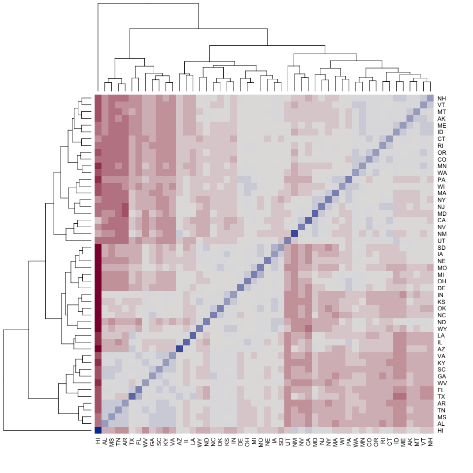

Exploring diversity across states legislatures in 2015
======================================================

State legislature diversity data were collected from the [National Conference of State Legislatures](http://www.ncsl.org/research/about-state-legislatures/who-we-elect-an-interactive-graphic.aspx#). These data provide the proportion of each state Congress that belongs to particular categories: \* Generation (Millenials, GenX, Boomers, Silent, and Greatest) \* Male:Female \* Education level (high school, bachelors, advanced) \* Occupation (agriculture, business, attorney, etc.) \* Race (Native American, African American, Asian American, etc.) \* Religion (Protestant, Catholic, Unspecified)

Figure 1.
---------

Heatmap that compares the euclidean distance between pairs of state legislatures (both House and Senate in 2015) in terms of diversity. Red indicates that the two states have different legislature diversity while blue indicates that the states have similar legislature diversity. The states are also clustered, showing that Hawaii's Congress is an outlier, while the other states are split fairly evenly into two groups. This grouping appears to correspond with overall diversity (as calculated by Shannon index, described below); states in the upper right group tend to be more diverse, while states in the lower left group tend to be less diverse.

 \#\# Figure 2. Nonmetric multidimensional scaling (NMDS) of the above euclidean distance matrix. State legislatures are color coded based on their Shannon diversity index (red = low, blue = high). Shannon diversity takes into account both richness of different categories that are present within the community and evenness across those categories. Gray vectors show the direction of the diversity categories and the strength of the correlation between the category and the NMDS ordination (longer vectors are stronger correlations). Only significanlty correlated vectors are shown.

As we can see, more diverse state legislatures (blue) have more minority and non Christian members. In addition these legislatures tend to be attorneys with advanced degrees in the GenX generation. Less diverse state legislatures (red) have more white (caucasian) members from the Baby Boomer generation. In addition these members tend to be business owners or in agriculture. Diversity categories that help explain variation across state legislatures but do not appear to influence Shannon diversity, include the proportion of members who are women, Protestant, and members with unspecified religious beliefs. Again, Hawaii's state legislature is shown as an outlier, likely since many members are Asian/Pacific Islander or multiracial.
